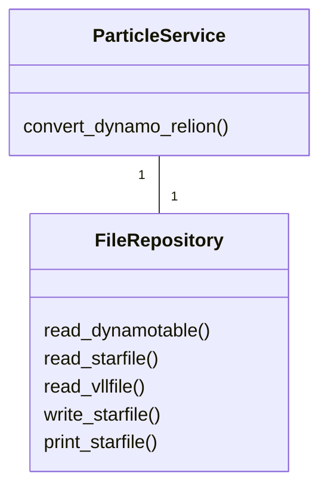

```mermaid
 classDiagram
    ParticleService "1" -- "1" FileRepository
    class ParticleService{
        convert_dynamo_relion()
    }
    class FileRepository{
        read_dynamotable()
        read_starfile()
        read_vllfile()
        write_starfile()
        print_starfile()
    }
```
