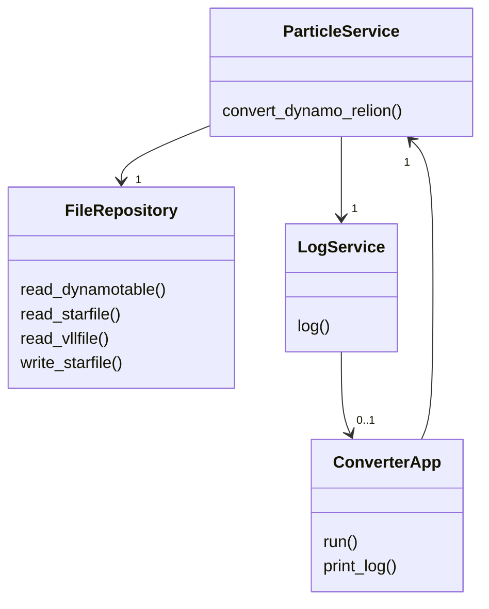
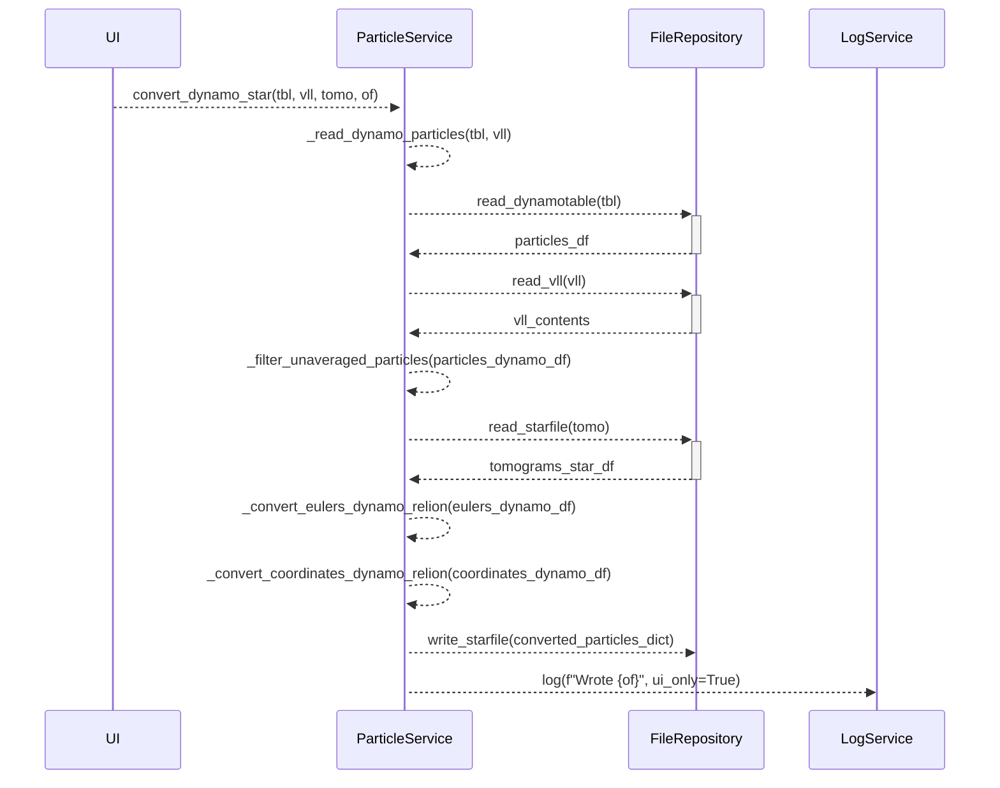

## Luokkakaavio

```mermaid
 classDiagram
    ParticleService --> "1" FileRepository
    ParticleService --> "1" LogService
    LogService --> "0..1" ConverterApp
    ConverterApp --> "1" ParticleService
    class ParticleService{
        convert_dynamo_relion()
    }
    class FileRepository{
        read_dynamotable()
        read_starfile()
        read_vllfile()
        write_starfile()
    }
    class LogService{
        log()
    }
    class ConverterApp{
        run()
        print_log()
    }
```

## Konversion sekvenssikaavio

Kun käyttöliittymässä on valittu käsiteltävät tiedostot tai ne on annettu parametreina, suoritus etenee seuraavasti:

```mermaid
sequenceDiagram
    participant UI
    participant ParticleService
    participant FileRepository
    participant LogService
    UI -->>+ParticleService: convert_dynamo_star(tbl, vll, tomo, of)
    ParticleService-->>ParticleService: _read_dynamo_particles(tbl, vll)
    ParticleService-->>+FileRepository: read_dynamotable(tbl)
    FileRepository-->>-ParticleService: particles_df
    ParticleService-->>+FileRepository: read_vll(vll)
    FileRepository-->>-ParticleService: vll_contents
    ParticleService-->>ParticleService: _filter_unaveraged_particles(particles_dynamo_df)
    ParticleService -->>+FileRepository: read_starfile(tomo)
    FileRepository -->>-ParticleService: tomograms_star_df
    ParticleService-->>ParticleService: _convert_eulers_dynamo_relion(eulers_dynamo_df)
    ParticleService-->>ParticleService: _convert_coordinates_dynamo_relion(coordinates_dynamo_df)
    ParticleService -->>FileRepository: write_starfile(converted_particles_dict)
    ParticleService -->>LogService: log(f"Wrote {of}", ui_only=True)
      
```
