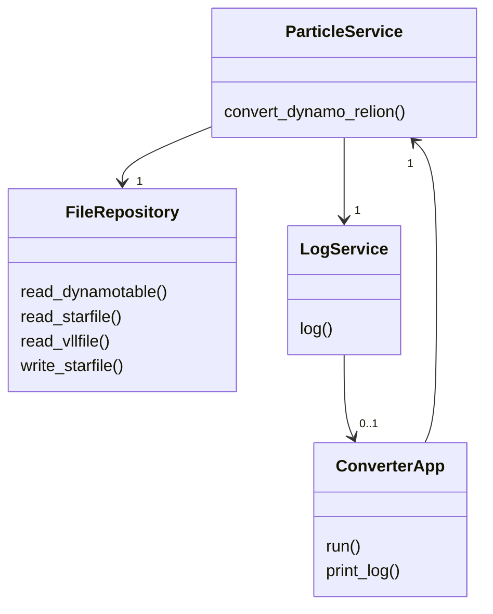

```mermaid
 classDiagram
    ParticleService --> "1" FileRepository
    ParticleService --> "1" LogService
    LogService --> "0..1" ConverterApp
    ConverterApp --> "1" ParticleService
    class ParticleService{
        convert_dynamo_relion()
    }
    class FileRepository{
        read_dynamotable()
        read_starfile()
        read_vllfile()
        write_starfile()
    }
    class LogService{
        log()
    }
    class ConverterApp{
        run()
        print_log()
    }
```
