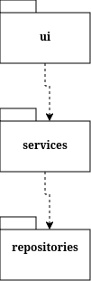
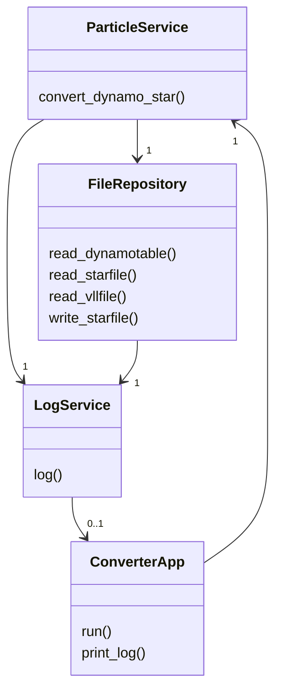
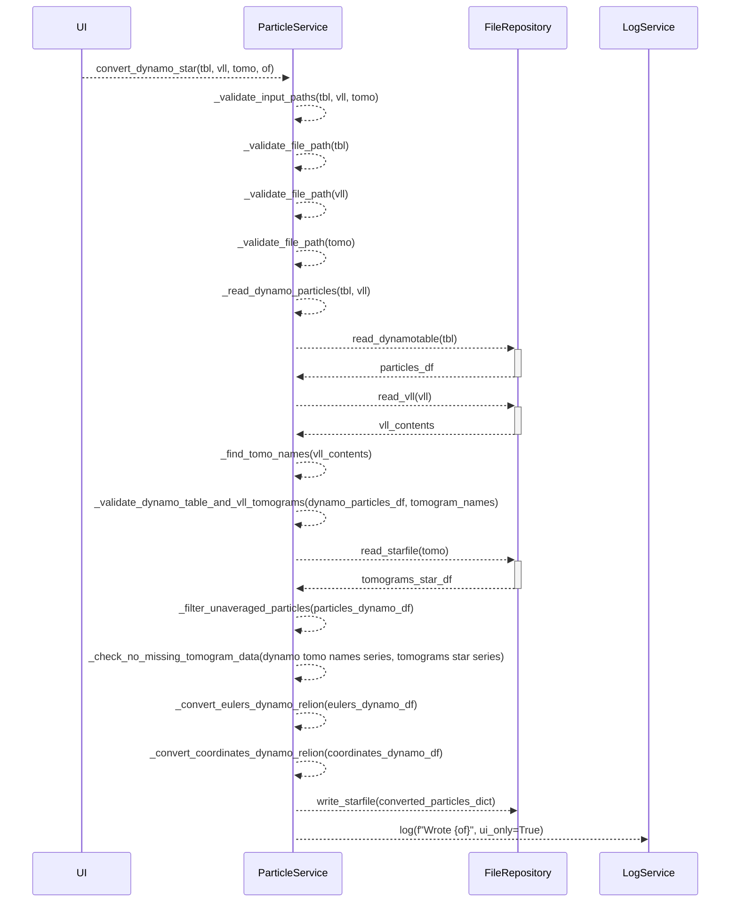

# Arkkitehtuurikuvaus

## Rakenne



Pakkaus _ui_ sisältää ohjelman käyttöliittymän, _services_ sovelluslogiikasta vastaavan koodin ja _repositories_ tallennuksesta vastaavan koodin.

## Sovelluslogiikka

Luokka [ParticleService](https://github.com/lainahai/ot-harjoitustyo/blob/main/src/services/particle_service.py) toteuttaa partikkelimetadatan konversion metodin ```convert_dynamo_star(table_file, vll_file, tomograms_file, output_file)``` kautta.

Tiedostojen lukemisesta ja kirjoittamisesta vastaa luokka [FileRepository](https://github.com/lainahai/ot-harjoitustyo/blob/main/src/repositories/file_repository.py).

Luokka [LogService](https://github.com/lainahai/ot-harjoitustyo/blob/main/src/services/log_service.py) vastaa ohjelman tulosteiden ohjaamisesta joko terminaaliin tai käyttöliittymään rippuen siitä, suoritetaanko ohjelmaa käyttöliittymän kanssa vai ilman sitä.

Käyttöliittymästä vastaa luokka [ConverterApp](https://github.com/lainahai/ot-harjoitustyo/blob/main/src/ui/converter_app.py).
Käyttöliittymän avulla käyttäjä voi valita konversiossa käytettävät metadatatiedostot, nimetä tallennettavan tiedoston ja tarkastella muunnettua dataa tallentamatta sitä. 

### Luokkakaavio



### Konversion eteneminen ja sekvenssikaavio

Kun käyttöliittymässä on valittu käsiteltävät tiedostot tai ne on annettu parametreina 
ja tulokset tallennetaan tiedostoon, suoritus etenee seuraavasti:

1. Validoitdaan tiedostopolut
2. Luetaan partikkelidata dynamo-taulukosta ja tomogrammien polut VLL-tiedostosta
3. Muunnetaan VLL-tiedoston sisältämät polut tomogrammien nimiksi ja yhdistetään nimet partikkelidataan
4. Varmistetaan, että jokaista partikkelia vastaava tomogrammi on VLL-tiedostossa
5. Luetaan tomogrammien tiedot sistältävä star-tiedosto
6. Suodatetaan pois sellaiset partikkelit, jotka on jätetty dynamossa analysoimatta
7. Varmistetaan, että partikkelidatassa viitattujen tomogrammien tiedot löytyivät star-tiedostosta. Konversio ei onnistu ilman jännitettä ja binning-kerrointa.
8. Muunnetaan Euler-kulmat Dynamon käyttämästä muodosta Relionin käyttämään muotoon
9. Muunnetaan koordinaatit binnaamaattomaan muotoon
10. Yhdistetään tiedot ja kirjoitetaan ne tiedostoon
11. Tulostetaan käyttöliittymään viesti onnistuneesta tallennuksesta



## Ohjelman rakenteeseen jääneet heikkoudet

[ParticleServicen](https://github.com/lainahai/ot-harjoitustyo/blob/main/src/services/particle_service.py) ```convert_dynamo_star```-metodi on hieman epäselvä ja turhan pitkä, mistä myös Pylint valittaa.

Validointiin käytetään nyt ParticleServicen metodeja, mutta ainakin valindointia laajenettaessa nykyisestä ne kannattaisi refaktoroida omaan pakettiinsa esimerkiksi erillisiksi funktioiksi.
