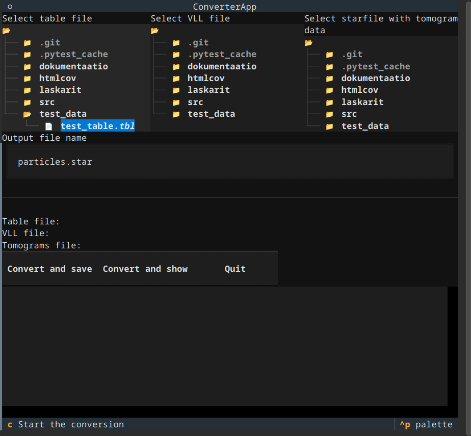

# Käyttöohje

Lataa ohjelman viimeisin [release](https://github.com/lainahai/ot-harjoitustyo/releases) Assets-osion Source code -linkistä ja pura koodi haluamaasi kansioon.

## Ohjelman käynnistäminen

Asenna ohjelman riippuvuudet suorittamalla

```poetry install```

Käynnistä ohjelma käyttöliittymässä suorittamalla

```poetry run invoke start```

Jos haluat tehdä konversion ilman käyttöliittymää, anna Dynamo-taulukon sisältäm tiedosto, vll-tiedosto ja tomogrammien metadatatiedosto parametreina.
Jos haluat tallentaa tiedot suoraan tiedostoon, anna myös tallennettavan tiedoston nimi. Muutoin tiedot tulostetaan terminaaliin.

```poetry run invoke table_file vll_file tomo_file [output_file]```

## Käyttöliittymä

Käyttöliittymään käynnistettäessä aukeaa näkymä, jossa tarvittavat metadatatiedosto voidaan valita.

Käyttöliittymä toimii hiirellä, mutta myös näppäinkomennoista voi olla hyötyä:

Tärkeimmät näppäinkomennot:

 - ```tab``` siirtyy elementtien välillä
 - Liiku tiedostojen valinnassa nuolinäppäimillä
 - ```enter``` hyväksyy 

 Valittujen tiedostojen polut näkyvät näppäimien yläpuolella.

Painikkeet:

 - __Convert and save__: suorittaa konversion ja tallentaa tulokset _Output file name_ -kentässä annettuun tiedostoon
 - __Convert and show__: suorittaa konversion ja tulostaa tulokset alaosan lokinäkymään.
 - __Quit__: Sulkee ohjelman.


