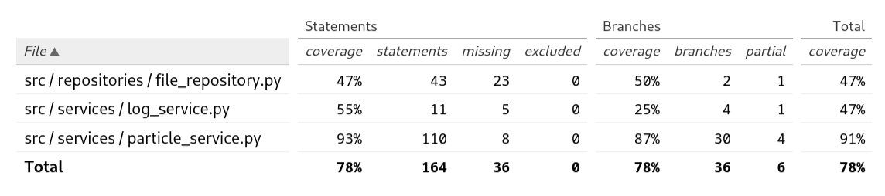

# Testausdokumentti

Ohjelmaa on testattu sekä automatisoiduilla yksikkö- ja integraatiotesteillä että käsin tehdyllä järjestelmätestauksella.

## Yksikkö- ja integraatiotestaus

### Sovelluslogiikka

Sovelluslogiikasta vastaavaan [ParticleService](https://github.com/lainahai/ot-harjoitustyo/blob/main/src/services/particle_service.py)-luokan testit ovat [TestParticleService](https://github.com/lainahai/ot-harjoitustyo/blob/main/src/tests/services/particle_service_test.py)-luokassa.
Testauksessa käytettävät repositorio- ja lokioliot on korvattu injektoiduilla valeolioilla, jotta vältytään tulostukselta ja tiedostojen käsittelyltä. ```MockRepository```-luokasta on myös tehty eri testitapauksiin hieman erilaisia versioita perintää hyödyntämällä.

Integraatiotestauksessa on käytetty oikeaa repositoriota ja lokipalvelua, mutta käyttöliittymää esittämään on luotu ```MockUi```-luokka, jonka avulla käyttöliittymässä näytettäväksi tarkoitetut tulosteet on saatu talteen.

Tulosteiden ohjaamiseen käytettyä LogService](https://github.com/lainahai/ot-harjoitustyo/blob/main/src/services/log_service.py)-luokka on niin  yksinkertainen, että sen yksikkötestaaminen ei tuntunut mielekkäältä. Luokkaa kuitenkin testataan integraatiotestauksen yhteydessä.

### Repositorio

[FileRepository](https://github.com/lainahai/ot-harjoitustyo/blob/main/src/repositories/file_repository.py)-luokkaa ei yksikkötestattu, koska tiedostojen käsittely perustuu lähes täysin ulkoisiin kirjastoihin eikä luokka sisällä juuri muuta logiikkaa kuin virheilmoitusten tulostamisen.
Kaikki luokan automaattinen testaus on siis integraatiotestausta yhdessä ```ParticleServicen``` kanssa.

### Testauskattavuus

Automatisoitujen testien haaraumakattavuus on 78%.



Testaamatta jäivät monet ```FileService```-luokan poikkeuskäsittelijät, esimerkiksi puuttuvista luku- tai kirjoitusoikeuksista johtuvien ```PermissionError```-poikkeusten käsittelijät. Lisäksi ```LogServicen``` tulostuksen testaaminen siististi tuntui tarpeettoman monimutkaiselta luokan yksinkertaisuuden vuoksi.

### Järjestelmätestaus

Kaikki vaatimusmäärittelyn toiminnallisuudet on testattu huolellisesti käsin.

Testausta on myös kokeiltu useilla erilaisilla virheellisillä tiedostoilla, jotka sisälsivät esimerkiksi puuttuvia sarakkeita ja virheellisiä viittauksia tomogrammidataan. Lisäksi ohjelmaa yritettiin suorittaa kuvatiedostoilla ja satunnaista binääridataa sisältävillä tiedostoilla. Syötteeksi ja tulostuskohteeksi annettiin myös tiedostoja, joihin ei ole luku- tai kirjoitusoikeuksia.

### Sovellukseen jääneet laatuongelmat

Tietojen validointi voisi olla laajempaa, esimerkiksi kulmien ja koordinaattien järkevyyttä ei nyt tarkasteta.

Ilman käyttöliittymää suoritettaessa virheilmoitukset tulostetaan nyt terminaaliin tavallisina tulosteina (```stdout```), vaikka ne pitäisi oikeastaan tulostaa mieluummin virhetulosteina (```stderr```). Tällöin virheilmoitukset tulostuisivat terminaaliin vaikka käyttäjä olisi ohjannut normaalitulosteen esim. tiedostoon.
